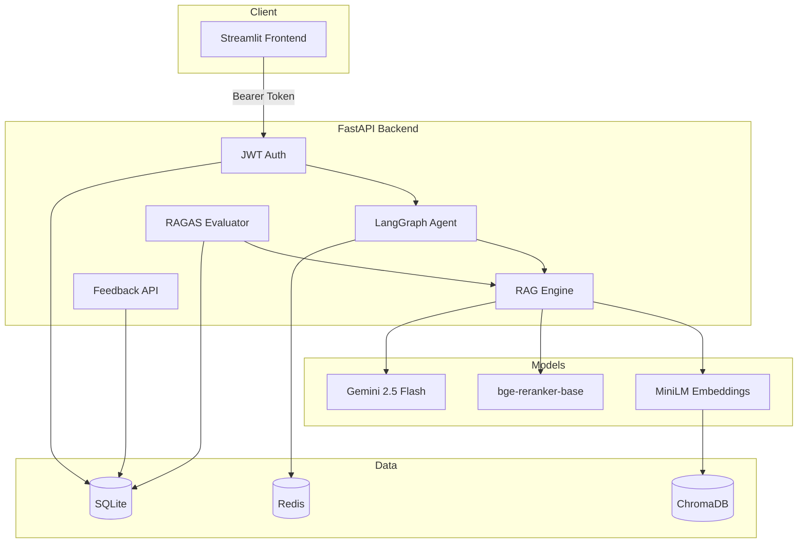
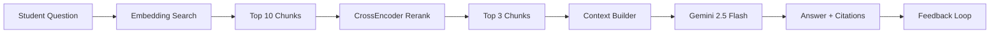

# CampusGPT — Portfolio Assets

## Resume Bullet Points

- **Built CampusGPT**, a production-grade RAG teaching assistant serving RGPV students using **FastAPI**, **Gemini 2.5 Flash**, **ChromaDB**, and **LangGraph** multi-agent orchestration, achieving sub-4s end-to-end query latency with CrossEncoder reranking (`BAAI/bge-reranker-base`).

- **Engineered a full MLOps-ready retrieval pipeline**: embedding search (top-10) → CrossEncoder rerank (top-3) → grounded generation, improving answer relevance via hybrid metadata filtering across subject, semester, and document type.

- **Implemented production authentication and persistence** with **JWT + bcrypt**, **SQLite ORM** (6 tables), and **Redis** session-backed conversation memory with automatic in-memory fallback.

- **Integrated RAGAS evaluation framework** measuring faithfulness, context precision, and answer relevancy; built analytics dashboard tracking user feedback satisfaction rates and query latency.

- **Deployed containerized microservices** (backend, frontend, Redis) via **Docker Compose** with CI-ready **pytest** suite (39+ tests) covering auth, API, RAG, and evaluation endpoints.

---

## LinkedIn Post

🎓 Excited to share **CampusGPT** — a production-grade RAG AI Teaching Assistant I built for university students!

Instead of generic ChatGPT answers, CampusGPT grounds every response in *your* lecture notes, PYQs, and lab manuals.

**What I built:**
✅ RAG pipeline with CrossEncoder reranking (BAAI/bge-reranker-base)
✅ LangGraph agent: Planner → Retriever → Memory → Generator
✅ JWT auth + SQLite + Redis conversation memory
✅ RAGAS evaluation (faithfulness, context precision, relevancy)
✅ 👍/👎 feedback loop with analytics dashboard
✅ 6 study modes: chat, exam prep, quiz, viva, assignments, PYQs

**Stack:** FastAPI · Streamlit · ChromaDB · Gemini 2.5 Flash · LangGraph · Docker

Built this as a flagship Applied AI / ML Engineering portfolio project — open to internships in ML Engineering, Applied AI, and MLOps!

#MachineLearning #RAG #GenerativeAI #FastAPI #LangChain #Portfolio #AIEngineering

---

## System Architecture Diagram

## RAG Pipeline Diagram

---

## Demo Screenshots Section

| Screen | Description |
|---|---|
| Chat Assistant | Dark-mode chat with source citations and confidence score |
| Analytics | Document/chunk counts, query stats, satisfaction rate |
| RAG Performance | RAGAS faithfulness, precision, relevancy metrics |
| Upload | Document ingestion with subject/semester metadata |
| Admin | Knowledge base management and document deletion |

*Replace with actual screenshots after running the app.*
